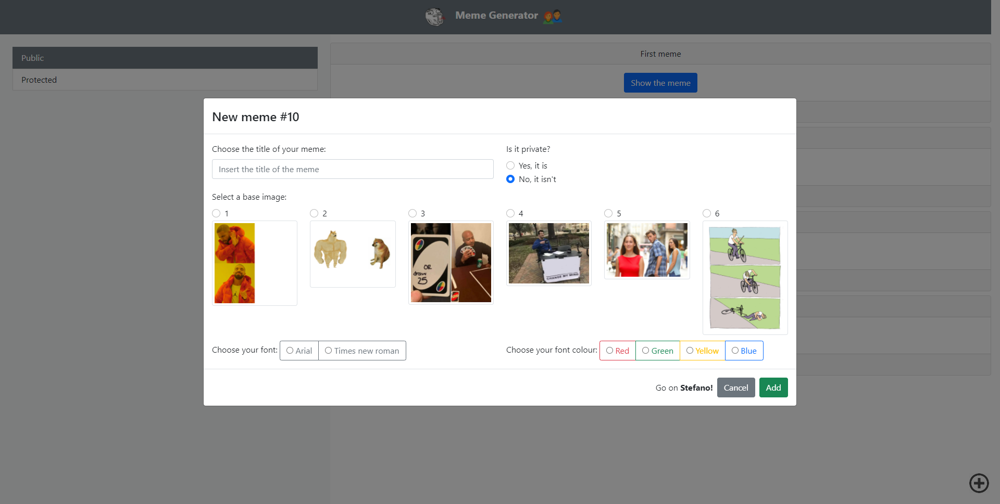

# Exam #2: "Meme Generator"
## Student: s282436 RAINò STEFANO

## React Client Application Routes

- Route `/`: redirect to the page `/public` if logged, else to the page `/login`
- Route `/login`: page related to do the login or to access like a normal user
- Route `/public`: page related to visualize all the public memes, in this page if the user is logged he can add a meme, delete an own meme or copy any meme
- Route `/protected`: page related to visualize all the protected memes, in this page if the user is logged he can add a meme, delete an own meme or copy any meme

## API Server

- POST `/api/sessions`
  - parameters: Object with credentials like `{password: ..., username: ...}`
  - body: Creadentials parsed in a json object like `JSON.stringify(credentials)`
  - response: `401 Unauthorized` (fail with message), `200 OK`
  - response body: 
  ```js
  {
    "id": 1,
    "username": "s.r@polito.it",
    "name": "Stefano"
  }
  ```
- GET `/api/memes/:filter`
  - parameters: Name related to the filter (`public` or `protected`)
  - description: List of all the memes related to the filter selected
  - response: `200 OK`, `204 No Content`, `500 Internal Server Error`
  - response body:
  ```js
  [{
    "id": 1,
    "creator": 1,
    "image": 1,
    "private": 0,
    "title": "First meme",
    "font": 2,
    "colour": "yellow"
  }, ...]
  ```
- GET `/api/image?id=<id>`
  - parameters: The id of the image that you want to select from the db
  - description: An object with all the parameters of the image that has the given id
  - response: `200 OK`, `204 No Content`, `500 Internal Server Error`
  - response body:
  ```js
  {
    "id": 1,
    "image": "images/meme1.png",
    "number_texts": 2,
    "pos1": 2,
    "pos2": 4,
    "pos3": null
  }
  ```
- GET `/api/images`
  - parameters: _None_
  - description: An array of objects with all the images and their parameters
  - response: `200 OK`, `204 No Content`, `500 Internal Server Error`
  - response body:
  ```js
  [{
    "id": 1,
    "image": "images/meme1.png",
    "number_texts": 2,
    "pos1": 2,
    "pos2": 4,
    "pos3": null
  }, ...]
  ```
- GET `/api/creator?id=<id>`
  - parameters: The id of the creator that we want to select from the db
  - description: The name of the creator related to the id passed
  - response: `200 OK`, `204 No Content`, `500 Internal Server Error`
  - response body: 
  ```js
  {
    "id": 1,
    "name": "Stefano"
  }
  ```
- GET `/api/texts?meme=<id>`
  - parameters: The id of the meme related to the texts that we want to select from the db
  - description: An array of objects with all the parameters associated to that texts
  - response: `200 OK`, `204 No Content`, `500 Internal Server Error`
  - response body:
  ```js
  [{
    "id": 1,
    "meme": 1,
    "image": 1,
    "text": "Web app secondo appello",
    "position": 4
  }, ...]
  ```
- POST `/api/meme`
  - parameters: The meme that we want to add
  - body: Meme parsed in a json object like `JSON.stringify({creator: ..., ..., colour: ...)`
  - description: The id of the new meme added to the database
  - response: `200 Ok`, `400 Bad Request`, `401 Unauthorized`, `500 Internal Server Error`
  - response body:
  ```js
  {
    "id": 10
  }
  ```
- POST `/api/text`
  - parameters: An aboject with all the parameters related to the text that we want to add
  - body: Text parsed in a json object like `JSON.stringify({meme: ..., ..., position: ...)`
  - description: The id of the new text added to the database
  - response: `200 Ok`, `400 Bad Request`, `500 Internal Server Error`
  - response body:
  ```js
  {
    "id": 10
  }
  ```
- DELETE `/api/texts/:id`
  - parameters: The id of the meme related to the texts that we want to delete
  - body: _None_
  - response: `200 Ok`, `400 Bad Request`, `500 Internal Server Error`
  - response body: _None_
- DELETE `/api/meme/:id`
  - parameters: The id of the meme that we want to delete
  - body: _None_
  - response: `200 Ok`, `400 Bad Request`, `500 Internal Server Error`
  - response body: _None_
- GET `/api/sessions/current`
  - parameters: _None_
  - body: _None_
  - description: An error messages if the user isn't authenticated or the username of the creator if him/her is authenticated
  - response: `200 Ok`, `401 Unauthorized`
  - response body: 
   ```js
  {
    "id": 1,
    "username": "s.r@polito.it",
    "name": "Stefano"
  }
  ```
- DELETE `/api/sessions/current`
  - parameters: _None_
  - body: _None_
  - response: _None_

## Database Tables

- Table `creator` - contains id, name, email and password
- Table `image` - contains id, number_texts, image, pos1, pos2, pos3
- Table `meme` - contains id, creator, image, private, title, font, colour
- Table `text` - contains id, meme, image, text, position

## Main React Components

- `AddButton` (in `AddButton.js`): The component is related to the add image that if clicked allows the creator to add a new meme according to the submission of the correlated modal
- `CustomNavbar` (in `CustomNavbar.js`): Navbar with the logos and the name of the site
- `Login` (in `Login.js`): Modal with the form for the login of the creator or with the button associated to continue the navigation like a normal user
- `MemeBoard` (in `MemeBoard.js`): Contains all the route associated to our project and in particular each route is associeted to a `MemeList` component
- `MemeList` (in `MemeBoard.js`): Contains a list of `MemeComponent` relatd to each meme passed throw prop
- `MemeComponent` (in `MemeBoard.js`): Contains the `Card` component releated to the meme passed and contains all the modals that can be visualized if we want to show or copy a particular meme
- `MemeModal` (in `MemeModal.js`): Contains the modal with the form that allow a creator to add a new meme
- `Sidebar` (in `Sidebar.js`): Contains the `ListGroup` component with two item associated to the protected and public memes

(only _main_ components, minor ones may be skipped)

## Screenshot




## Users Credentials

- s.r@polito.it, Stefano13 
- c.p@polito.it, Carmelo8
- l.m@polito.it, Lorenzo10
